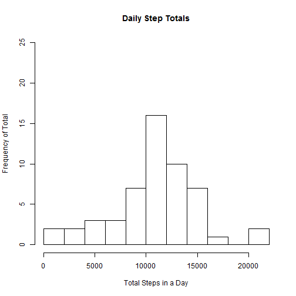
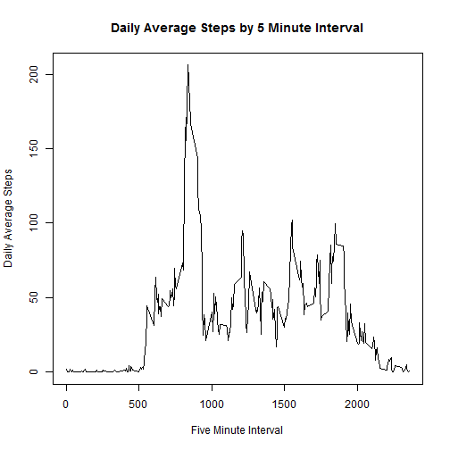
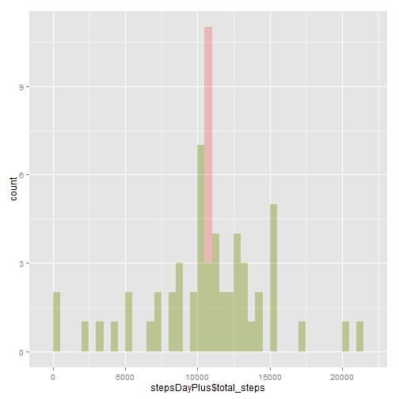
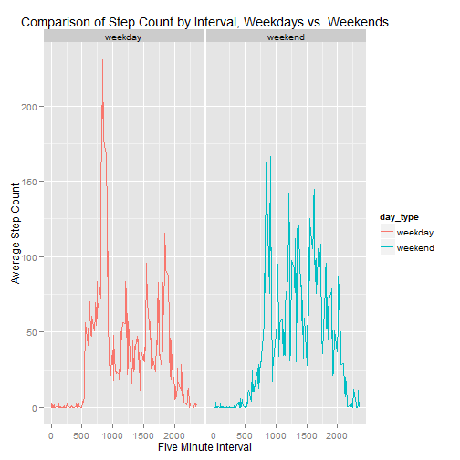

# Reproducible Research Peer Assessment Assignment 1

## Nick Hartman :: [github/repo](https://github.com/kingofharts/RepData_PeerAssessment1)


This markdown file contains the necessary markdown, commentary and code to produce the knitr'd HTML file required for this assignment.  This file assumes that the provided data source file ("repdata-data-activity.zip") is available in your working directory.

---

### Assignment Phase 1: Load and pre-process the data.

The code below sets expectations of the data per the assigment instructions, loads the data, and validates those data against the preset expectations.  Finally, the date column is converted from factor to date class.


```r
## Generate Expected Names variable

expectedNames <- c("steps","date","interval")

## Generate Expected Row Count variable

expectedRows <- 17568

## Unpack, read in source data

unzip(
      zipfile = "repdata-data-activity.zip",
      overwrite = TRUE
)

data <- data.frame(read.csv("activity.csv"))

## Validate against expectations

names(data) == expectedNames
```

```
## [1] TRUE TRUE TRUE
```

```r
nrow(data) == expectedRows
```

```
## [1] TRUE
```

```r
## Clean up Date formatting

require(lubridate)

data$date <- ymd(data$date)
```

---

### Assignment Phase 2: Make a Histogram of total steps each day, with the mean and median daily total reported separately.

After preprocessing the data into a flat object ("data"), steps-by-day is aggregated as a new object for plotting and summary by mean and median.


```r
## Aggregate flat data into object focused on total steps by day

stepsDay <- aggregate(
                        x=data$steps,
                        by=list(data$date),
                        FUN="sum"
                  )

## Clean up names, formatting

names(stepsDay) <- c("date","total_steps")

## Plot the Histogram

hist(
      stepsDay[,2], 
      breaks=15, 
      xlab="Total Steps in a Day", 
      ylab="Frequency of Total", 
      main="Daily Step Totals",
      ylim=c(0,25)
)
```

 

```r
## Return the mean total steps per day

mean(
      stepsDay$total_steps, 
      na.rm = TRUE
)
```

```
## [1] 10766
```

```r
## Return the median total steps per day

median(
      stepsDay$total_steps, 
      na.rm = TRUE
)
```

```
## [1] 10765
```

---

### Assignment Phase 3: Average Daily Activity Pattern.

Going back to the data object, a new aggregated object is constructed and plotted from based on average steps by each five minute interval.  Finally, the interval with the maximum average step count is returned.


```r
## Aggregate flat data into object focused on average steps by interval

stepsInterval <- aggregate(
                              x=data$steps,
                              by=list(data$interval),
                              FUN="mean",
                              na.rm = TRUE
                        )

## Clean up names, formatting

names(stepsInterval) <- c("interval","average_steps")

## Create plot

plot(
      stepsInterval[,1], 
      stepsInterval[,2], 
      type="l", 
      xlab="Five Minute Interval", 
      ylab="Daily Average Steps", 
      main="Daily Average Steps by 5 Minute Interval"
)
```

 

```r
## Return daily interval with maximum average steps

stepsInterval[stepsInterval[,2]==max(stepsInterval[,2]),]
```

```
##     interval average_steps
## 104      835         206.2
```

---

### Assignment Phase 4: NAs and their substitution with imputed values.

A quick summary call shows the count of rows with NAs in the step count.


```r
summary(data)
```

```
##      steps            date               interval   
##  Min.   :  0.0   Min.   :2012-10-01   Min.   :   0  
##  1st Qu.:  0.0   1st Qu.:2012-10-16   1st Qu.: 589  
##  Median :  0.0   Median :2012-10-31   Median :1178  
##  Mean   : 37.4   Mean   :2012-10-31   Mean   :1178  
##  3rd Qu.: 12.0   3rd Qu.:2012-11-15   3rd Qu.:1766  
##  Max.   :806.0   Max.   :2012-11-30   Max.   :2355  
##  NA's   :2304
```

2,304.

To replace these, I've opted to insert the average of the non-NA values for the corresponding interval for each row with an NA in the steps variable.


```r
## load plyr package

require(plyr)

## Create new data frame with additional column of averages for that row's interval

dataPlus <- join(data,stepsInterval, by = "interval")

## Create index of NAs to replace

NANAs <- is.na(dataPlus$steps)

## Replace NAs with average steps for that row's interval

dataPlus$steps[NANAs] <- dataPlus$average_steps[NANAs]

## Clean up frame, drop average column

dataPlus <- dataPlus[,-4]

## Check for NAs

summary(dataPlus)
```

```
##      steps            date               interval   
##  Min.   :  0.0   Min.   :2012-10-01   Min.   :   0  
##  1st Qu.:  0.0   1st Qu.:2012-10-16   1st Qu.: 589  
##  Median :  0.0   Median :2012-10-31   Median :1178  
##  Mean   : 37.4   Mean   :2012-10-31   Mean   :1178  
##  3rd Qu.: 27.0   3rd Qu.:2012-11-15   3rd Qu.:1766  
##  Max.   :806.0   Max.   :2012-11-30   Max.   :2355
```

With the new data frame in hand, I first reaggregate into total steps by day with imputed values, then add in the original steps by day totals.


```r
## Aggregate new flat data into object focused on total steps by day

stepsDayPlus <- aggregate(
                        x=dataPlus$steps,
                        by=list(dataPlus$date),
                        FUN="sum"
                  )

## Clean up names, formatting

names(stepsDayPlus) <- c("date","total_steps")

## Merge data objects for better comparison

stepsDayPlus[,3] <- stepsDay[,2]

names(stepsDayPlus)[3] <- "total_steps_NAs"
```

Now with a combined data frame of totals with and without imputed values, I plot a histogram with the two sets overlaid.


```r
## Load ggplot2

require(ggplot2)

## Plot comparison Histogram

plot <- ggplot(data = stepsDayPlus)

plot.1 <- plot + geom_histogram(aes(x=stepsDayPlus$total_steps),fill = "red", alpha = 0.2, binwidth = 500)

plot.2 <- plot.1 + geom_histogram(aes(x=stepsDayPlus$total_steps_NAs),fill = "green", alpha = 0.2, binwidth = 500)

plot.2
```

 

My initial reaction is that rather than timeslots with NAs scattered across the various days, several complete days went unrecorded, resulting in a big spike of the average daily total once the average across all days was substituted in for NA values.

Said differently, instead of having 61 days with some missing slots each, it appears from this perspective rather like there were ~53 complete days and ~8 totally empty days, which all went to the mean due to the imputation methodology selected.

Quick way to check this thinking is to see if there's any shift in the mean from the NA set.


```r
## Create a data frame for comparing means & medians

comparison <- data.frame(1:2,1:2)

names(comparison) <- c("mean","median")

row.names(comparison) <- c("NAs","imputed")

## Insert mean total steps per day w/ NAs

comparison[1,1] <- mean(stepsDay$total_steps, na.rm = TRUE)

## Insert mean total steps per day w/ imputed values

comparison[2,1] <- mean(stepsDayPlus$total_steps)

## Insert median total steps per day w/ NAs

comparison[1,2] <- median(stepsDay$total_steps, na.rm = TRUE)

## Insert median total steps per day w/ imputed values

comparison[2,2] <- median(stepsDayPlus$total_steps)

## Return the data frame for comparison

comparison
```

```
##          mean median
## NAs     10766  10765
## imputed 10766  10766
```

Which there appears not to be.

---

### Assignment Phase 5: Are there differences in activity patterns between weekdays and weekends?

The last phase of the analysis involves differentiation between weekday activity and weekend activity.  Our first step is to create the weekday/weekend variable.


```r
## Create index of weekdays for each row

wdays <- (wday(data$date) %in% c(2:6))

weekd <- gsub(TRUE,"weekday",wdays)

weekdays <- gsub(FALSE,"weekend",weekd)

## Append index as additional variable to data frame

dataPlus <- cbind(dataPlus, weekdays)

## Aggregate flat data into object focused on average steps by interval

stepsIntervalWdays <- aggregate(
                        x=dataPlus$steps,
                        by=list(dataPlus$interval,dataPlus$weekdays),
                        FUN="mean",
                        na.rm = TRUE
                        )

## Clean up names, formatting

names(stepsIntervalWdays) <- c("interval","day_type","average_steps")

## Create plot

plot.3 <- ggplot(
                  data = stepsIntervalWdays, 
                  aes(x=interval, y=average_steps,colour = day_type,
                  group = day_type)
                  )

plot.4 <- plot.3 +
            geom_line() +
            facet_wrap(~day_type) +
            xlab("Five Minute Interval") +
            ylab("Average Step Count") +
            ggtitle("Comparison of Step Count by Interval, Weekdays vs. Weekends")

plot.4
```

 


